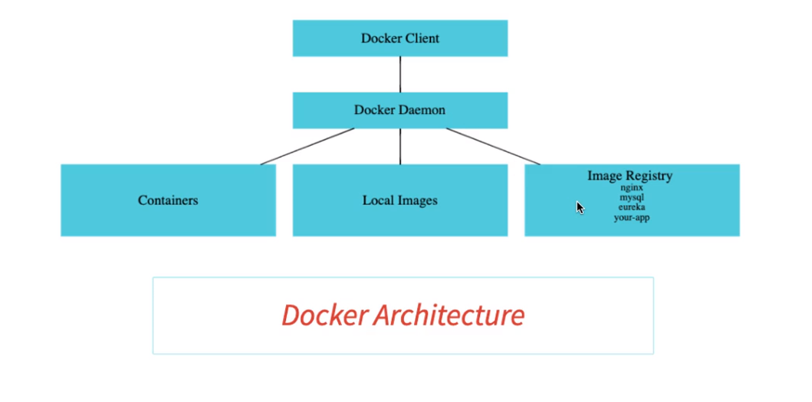
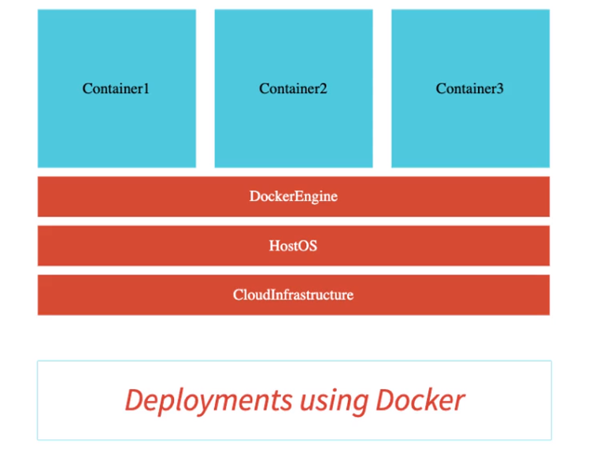

[//]: # (explain below what is docker)

# Docker
Docker is a tool designed to make it easier to create, deploy, and run applications by using containers.<br>
Containers allow a developer to package up an application with all of the parts it needs, <br>
such as libraries and other dependencies, and ship it all out as one package.
* Create a Docker images for each microservice
* Docker image contains everything needed to run the microservice : 
  * code
  * runtime
  * libraries
  * environment variables
  * configuration files
* You can run these docker containers the same way on any infrastructure
## Docker Architecture


## Deployments with Docker


## CMD Docker commands for images
### To pull an image from docker hub
```cmd
docker pull <image-name>
```
### To see all the images
```cmd
docker images
```
### To remove an image
```cmd
docker rmi <image-id>
```
### To remove all the images
```cmd
docker rmi $(docker images -q)
```
### To change the tag of an image
```cmd
docker tag <image-id> <new-tag>
```
### To push an image to docker hub
```cmd
docker push <image-name>
```
### To inspect an image
```cmd
docker inspect <image-name>
```
### To see the history of an image
```cmd
docker history <image-name>
```
## CMD Docker commands for containers
### Run a container 
```cmd
docker run -p 5000:5000 -d in28min/todo-rest-api-h2:1.0.0.RELEASE
```
* -p 5000:5000 : Map port 5000 of the container to port 5000 on host machine (localhost) // if not specified you can't access
* -d : Run the container in detached mode (in the background) // crt+c to stop won't work
* in28min/todo-rest-api-h2:1.0.0.RELEASE : Image name and version to run // it's pointing to docker hub repository
### To Stop a container
```cmd
docker stop <container-id>
```
### To kill a container
```cmd
docker kill <container-id>
```
### To pause a container
```cmd
docker pause <container-id>
```
### To unpause a container
```cmd
docker unpause <container-id>
```
### To remove all stopped containers
```cmd
docker container prune
```
### To inspect a container
```cmd
docker inspect <container-id>
```
### To see the logs of the container
```cmd
docker logs <container-id>
```
### To see the logs of the container in real time
```cmd
docker logs -f <container-id> 
```
### To see the running containers
```cmd
docker ps
```
### To see all the containers
```cmd
docker ps -a
```
### To remove the container
```cmd
docker rm <container-id>
```
### To remove all the containers
```cmd
docker rm $(docker ps -a -q)
```
## CMD Docker commands (extra)
### To see the events of docker
```cmd
docker events
```
### To check all the processes running inside a specific container
```cmd
docker top <container-id>
```
### To see the stats of a container
```cmd
docker stats <container-id>
```
### To see the disk usage of docker
```cmd
docker system df
```
## CMD Docker commands policy
### Restart
* no : Never restart
* always : Always restart
* on-failure : Restart only if the container stops with an error code
* unless-stopped : Always restart unless we forcibly stop it
```cmd
docker run -p 5000:5000 -d --restart=always in28min/todo-rest-api-h2:1.0.0.RELEASE
```
### Allocate Memory
```cmd
docker run -p 5000:5000 -d -m 512m in28min/todo-rest-api-h2:1.0.0.RELEASE
```
### Allocate CPU
```cmd
docker run -p 5000:5000 -d --cpu-quota=50000 in28min/todo-rest-api-h2:1.0.0.RELEASE
```


