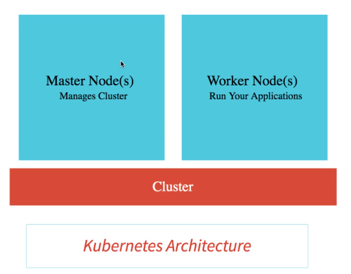
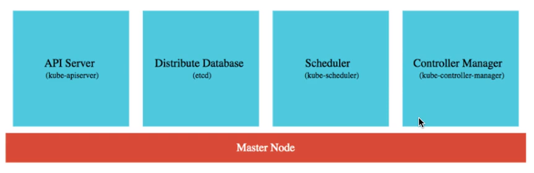
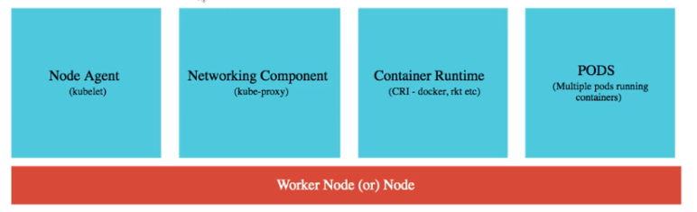
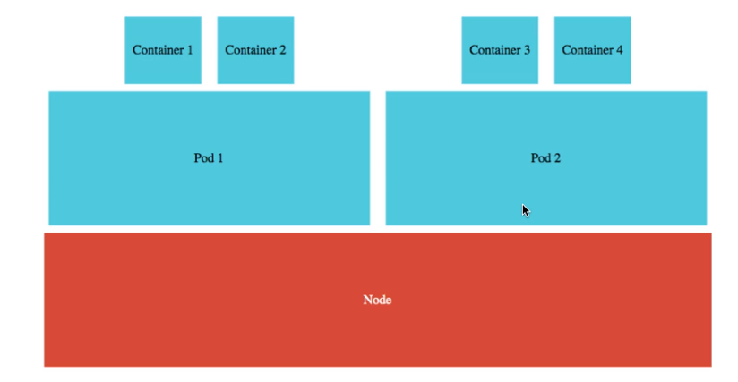
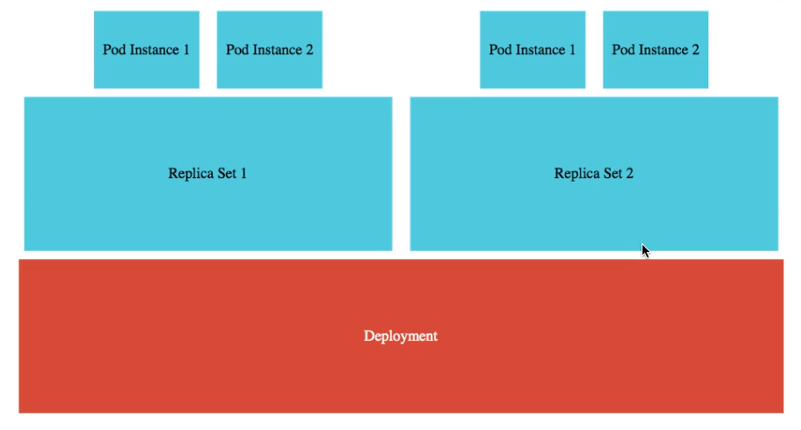

# Container Orchestration
## Typical Features :
* Auto Scaling -> Scale containers based on demand
* Self Healing -> Restart containers that have failed
* Zero Downtime Deployments -> Deploy new versions of containers without downtime
* Service Discovery -> Enable containers to find each other
* Load Balancing -> Distribute load among multiple instance of a microservice

# Kubernetes Architecture

## Master Node
Manages the cluster and is responsible for making decisions about the cluster.
* **API Server** : kube-apiserver -> Provides a REST API to interact with the cluster
* **Distribute Database** : Etcd -> Stores the state of the cluster
* **Scheduler** : kube-scheduler -> Distributes work across multiple nodes
* **Controller Manager** : kube-controller-manager -> Detects and responds to cluster events

## Worker Node
Runs the containers.
* Node Agent : kubelet -> Communicates with the master node
* Networking Component : kube-proxy -> Routes traffic to containers
* Container Runtime : docker -> Runs containers
* Pod : A group of one or more containers, with shared storage/network, and a specification for how to run the containers.

## Cluster
A Kubernetes cluster is composed of a master node and a number of worker nodes.<br>
The master node controls the state of the cluster, such as which applications are running and their container images.<br>
Worker nodes run containerized applications.


# Google Kubernetes Engine (GKE)
## Connect the cluster
```cmd
gcloud container clusters get-credentials in28minutes-cluster --zone us-central1-a --project solid-course-258105
```
## Create a deployment
```cmd
kubectl create deployment hello-world-rest-api --image=in28min/hello-world-rest-api:0.0.1.RELEASE
```
## Expose the deployment
```cmd
kubectl expose deployment hello-world-rest-api --type=LoadBalancer --port=8080
```
## Pods
#### A pod is the smallest deployable unit of computing that can be created and managed in Kubernetes.
#### Is a group of one or more containers, with shared storage/network, and a specification for how to run the containers.
#### Each pod has a uunique IP address
### Provides a categorization for all the containers by associating them with labels
```cmd
kubectl get pods -o wide
```
```cmd
kubectl describe pod <pod-name>
```

## Replica Sets
#### Replica sets are used to ensure that a specified number of pod replicas are running at any given time.
```cmd
kubectl scale deployment hello-world-rest-api --replicas=3
```

## Events
#### Events are used to track the progress of various operations in the cluster.
```cmd
kubectl get events --sort.by=.metadata.creationTimestamp
```
## Deployments
```cmd
kubectl set image deployment <deployment-name> <container-name>=<image-path>
```
Example:
```cmd
kubectl set image deployment hello-world-rest-api hello-world-rest-api=in28min/hello-world-rest-api:0.0.2.RELEASE
```
## Services
#### A service allows your application to receive traffic through a permanent IP address.
```cmd
kubectl get services
```

---

---

# Project environment
#### Kubernetes provides the features instead of Eureka Server and Api Gateway