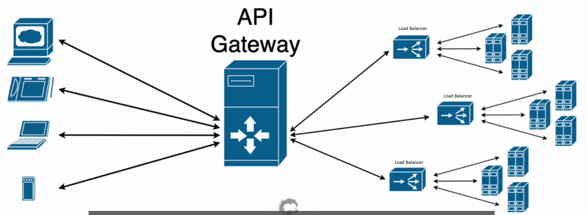
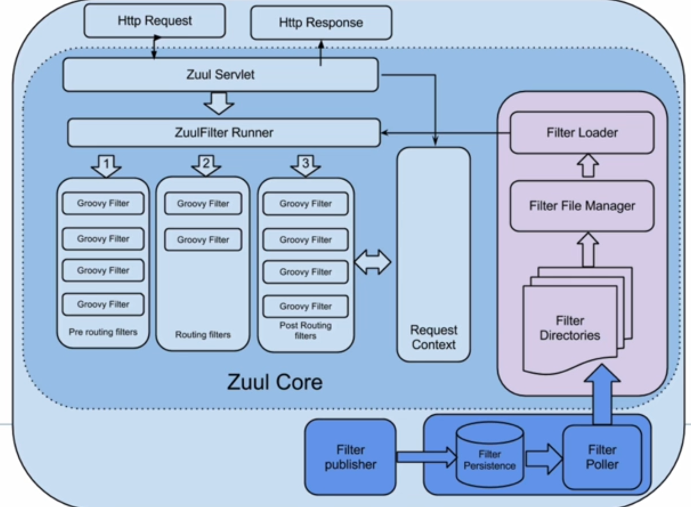
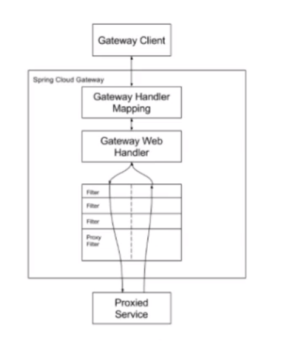
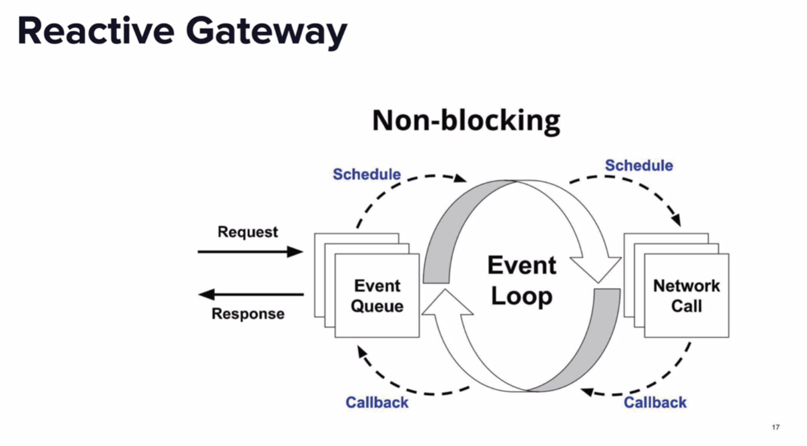

# MATTEO MOI
---
# Microservices w/ Spring Boot
### TOC
[//]: # (TOC generated with https://ecotrust-canada.github.io/markdown-toc/)
- [Microservices w/ Spring Boot](#microservices-w-spring-boot)
  - [TOC](#toc)
  - [Microservices](#microservices)
    - [Definition](#definition)
    - [Microservices are based on](#microservices-are-based-on)
    - [Advantages of microservices](#advantages-of-microservices)
  - [Spring Cloud](#spring-cloud)
    - [Spring Cloud is composed by](#spring-cloud-is-composed-by)
  - [Dynamic scale up and down of services](#dynamic-scale-up-and-down-of-services)
  - [Visibility and monitoring of microservices](#visibility-and-monitoring-of-microservices)
  - [Spring Cloud Config](#spring-cloud-config)
    - [On the server side](#on-the-server-side)
    - [On the client side](#on-the-client-side)
    - [On URL](#on-url)
  - [Setting Dynamic Port](#setting-dynamic-port)
    - [On REST controller](#on-rest-controller)
    - [On POJO](#on-pojo)
  - [Microservices communication](#microservices-communication)
    - [Mapping using RestTemplate](#mapping-using-resttemplate)
    - [Mapping with Feign](#mapping-with-feign)
      - [On Application class](#on-application-class)
      - [Create a proxy interface](#create-a-proxy-interface)
      - [On Rest controller](#on-rest-controller)
  - [Euraka Naming Server](#euraka-naming-server)
      - [On POM](#on-pom)
      - [On Application class](#on-application-class-1)
      - [On Propreties](#on-propreties)
      - [On Propreties](#on-propreties-1)
  - [API Gateway](#api-gateway)
    - [On POM](#on-pom-1)
    - [On Propreties](#on-propreties-2)
  - [Routing](#routing)
    - [On Configuration class](#on-configuration-class)


## Definition
- **Microservice architecture is an approach to developing a single application as a suite of small services,<br>**
**each running in its own process and communicating with lightweight mechanisms, often an HTTP resource API.<br>**
- **These services are built around business capabilities and independently deployable by fully automated deployment machinery<br>**
- **There is a bare minimum of centralized management of these services, which may be written in different P.L. and use different data storage technologies<br>**

## Microservices are based on
- **RESTfull services**
- **Small and well chosen deployable units**
- **Cloud enable : create and delete istance of a specific microservice without huge problems**
- **Decentralized architecture**

## Advantages of microservices
- **Technology heterogeneity** : Each microservice can be developed with a different technology
- **Resilience** : If a microservice fails, the other microservices are not affected
- **Scaling** : Each microservice can be scaled independently
- **Ease of deployment** : Each microservice is deployed independently
- **Organizational alignment** : Microservices are aligned with the organizational structure of the company
- **Optimizing for scalability** : Microservices can be scaled independently
- **Optimizing for replaceability** : Microservices can be replaced with a rewrite
- **Optimizing for evolvability** : Microservices can evolve independently
- **Optimizing for testability** : Microservices can be tested independently
- **Optimizing for debuggability** : Microservices can be debugged independently
- **Optimizing for deployability** : Microservices can be deployed independently
- **Optimizing for replaceability** : Microservices can be replaced with a rewrite
- **Optimizing for organizational agility** : Microservices can be developed by different teams
---
# Spring Cloud
### Spring Cloud is a framework that provides a variety of features to support the development of microservices :
- **Service discovery**
- **Circuit breakers**
- **Routing**
- **Load balancing**
- **Global locks**
- **Configuration management**
- **Authentication and authorization**
- **Metrics and monitoring**
- **Distributed sessions**
- **Cluster state**

## Spring Cloud is composed by

[//]: # (make a list of all the projects starting from the most know and used that compose Spring Cloud ad associate a link to the official documentation and a short description of the project)
- **Spring Cloud Config** : https://cloud.spring.io/spring-cloud-config/ <br>   **Configuration management** : Centralized external configuration management backed by a git repository
- **Spring Cloud Netflix** : https://cloud.spring.io/spring-cloud-netflix/ <br>   **Service discovery** : Service discovery with Netflix Eureka and client side loadbalancing with Ribbon and Feign
- **Spring Cloud AWS** : https://cloud.spring.io/spring-cloud-aws/ <br>   **Cloud platform support** : Support for AWS services such as S3, SQS, SNS, DynamoDB, SES, SSM, ACM, ElastiCache, CloudWatch, Kinesis, and CloudFormation with Spring Cloud AWS
- **Spring Cloud Kubernetes** : https://cloud.spring.io/spring-cloud-kubernetes/ <br>   **Cloud platform support** : Support for Kubernetes with Spring Cloud Kubernetes and Kubernetes native Spring Boot integrations
- **Spring Cloud Bus** : https://cloud.spring.io/spring-cloud-bus/ <br>   **Configuration management** : Event bus for propagating state changes (e.g. configuration changes) across nodes
- **Spring Cloud Security** : https://cloud.spring.io/spring-cloud-security/ <br>   **Authentication and authorization** : Security features backed by Spring Security
- **Spring Cloud Sleuth** : https://cloud.spring.io/spring-cloud-sleuth/ <br>   **Metrics and monitoring** : Distributed tracing via logs with Zipkin and Sleuth
- **Spring Cloud Stream** : https://cloud.spring.io/spring-cloud-stream/ <br>   **Messaging** : Messaging microservices with Redis, Rabbit or Kafka as the broker and support for Spring Integration and Spring Batch for event-driven microservices orchestration
- **Spring Cloud Task** : https://cloud.spring.io/spring-cloud-task/ <br>   **Batch processing** : Short-lived microservices with Spring Batch as the underlying batch processing framework and Spring Integration for event-driven microservices orchestration
- **Spring Cloud Zookeeper** : https://cloud.spring.io/spring-cloud-zookeeper/ <br>   **Service discovery** : Service discovery with Apache Zookeeper and client side loadbalancing with Ribbon and Feign
- **Spring Cloud Consul** : https://cloud.spring.io/spring-cloud-consul/ <br>   **Service discovery** : Service discovery with Consul and client side loadbalancing with Ribbon and Feign
- **Spring Cloud Contract** : https://cloud.spring.io/spring-cloud-contract/ <br>   **Testing** : Consumer Driven Contracts testing with Spring Cloud Contract Verifier and Stub Runner modules and Pact support for HTTP based messaging systems
- **Spring Cloud Function** : https://cloud.spring.io/spring-cloud-function/ <br>   **Programming model** : Support for writing functions as Spring beans and running them locally or in the cloud via Spring Cloud Function
- **Spring Cloud Gateway** : https://cloud.spring.io/spring-cloud-gateway/ <br>   **Routing** : Gateway service with support for Websockets, HTTP routing and a range of filters such as rate limiting, circuit breakers, request caching and others
- **Spring Cloud OpenFeign** : https://cloud.spring.io/spring-cloud-openfeign/ <br>   **Service discovery** : Declarative REST client with support for Feign annotations and Netflix Ribbon as the client side loadbalancer and Eureka as the service registry and discovery module
- **Spring Cloud Pipelines** : https://cloud.spring.io/spring-cloud-pipelines/ <br>   **Continuous delivery** : Deployment pipeline DSL for deploying applications to Cloud Foundry, Kubernetes or AWS with Spinnaker and Jenkins as the underlying CI/CD platform and Concourse as the alternative CI/CD platform

---

## Dynamic scale up and down of services
- **Naming server : Eureka** -> Service discovery and registration of microservices
- **Client side load balancing** :  Ribbon -> Load balancing between microservices
- **Client side service discovery : Feign** -> Declarative REST client

## Visibility and monitoring of microservices
- **Zipkin** -> Distributed tracing system
- **Netflix API Gateway** -> Routing and filtering
- **Hystrix** -> Fault tolerance between microservices
- **Hystrix Dashboard** -> Monitor Hystrix metrics in real time
- **Prometheus** -> Monitoring system and time series database

## Spring Cloud Config
[//]: # (Explain in details with a text and not only with lists how to use Spring Cloud Config to manage the configuration of microservices)
Is a framework for externalizing configuration properties into a remote repository. <br>
Provides server and client-side support for externalized configuration in a distributed system. <br>
With the Config Server you have a central place to manage external properties for applications across all environments. <br>
The concepts on both client and server map identically to the Spring Environment and PropertySource abstractions, so they fit very well with Spring applications but can be used with any application running in any language. <br>
As an application moves through the deployment pipeline from dev to test and into production you can manage the configuration between those environments and be certain that applications have everything they need to run when they migrate. <br>
The default implementation of the server storage backend uses git so it easily supports labelled versions of configuration environments as well as being accessible to a wide range of tooling for managing the content. <br>
It is easy to add alternative implementations and plug them in with Spring configuration. <br>
Out of the box the server is REST based with lightweight semantics. <br>
It is easy to customize the server to handle different content types and use alternative transports. <br>
On the client side, the config client library provides Spring @Configuration style binding from external properties sources into Java beans. <br>
It also provides support for Spring Environment and PropertySource abstractions. <br>
The goal of the Config Server and Config Client is to provide a central place for managing external properties for applications across all environments. <br>

### On the server side
- **Add the dependency** : spring-cloud-config-server
```properties
spring.application.name=spring-cloud-config-server
server.port=8888
spring.cloud.config.server.git.uri=file:///C:/Users/jokmo/IdeaProjects/Microservices/git-localconfig-repo
```
- **Add the annotation** : @EnableConfigServer
```java
@EnableConfigServer // This annotation enables the Spring Cloud Config Server
@SpringBootApplication
public class SpringCloudConfigServerApplication {
```
- **Create the file** : limits-service.properties
```properties
limits-service.minimum=4
limits-service.maximum=996
```
For each environment you can create a specific file with the name of the microservice and the name of the environment. <br>
- **Create the file** : limits-service-dev.properties
```properties
limits-service.minimum=5
limits-service.maximum=997
```
#### On URL
http://localhost:8888/limits-service/default or http://localhost:8888/limits-service/dev
```json
{
  "name": "limits-service",
  "profiles": [
    "default"
  ],
  "label": null,
  "version": "a07d4634b290375f8d2215e0b76350f434f4650c",
  "state": null,
  "propertySources": [
    {
      "name": "file:///C:/Users/jokmo/IdeaProjects/Microservices/git-localconfig-repo/limits-service.properties",
      "source": {
        "limits-service.minimum": "4",
        "limits-service.maximum": "996"
      }
    }
  ]
}
```
### On the client side
#### On POM
- **Add the dependency** : spring-cloud-starter-config
```xml
<dependency>
    <groupId>org.springframework.cloud</groupId>
    <artifactId>spring-cloud-starter-config</artifactId>
    <version>2.2.2.RELEASE</version>
</dependency>
```
#### On Propreties
```properties
spring.application.name=limits-service
spring.cloud.config.import=optional:configserver:http://localhost:8888
```
For use a specific environment you can add a specific profile in the properties file. <br>
```properties
spring.profiles.active=dev
spring.cloud.config.profile=dev
```
#### On URL
http://localhost:8080/limits
```json
{
  "minimum": 4,
  "maximum": 996
}
```
## Setting Dynamic Port
```properties
server.port=8080
```
#### On REST controller
```java
@RestController
public class CurrencyExchangeController {
    //http://localhost:8000/currency-exchange/from/USD/to/INR
    @Autowired
    private Environment environment;
    @GetMapping("/currency-exchange/from/{from}/to/{to}")
    public CurrencyExchange retriveExchangeValue(@PathVariable String from, @PathVariable String to){
        CurrencyExchange currencyExchange = new CurrencyExchange(1000L,from,to, BigDecimal.valueOf(50));
        String port = environment.getProperty("local.server.port");
        currencyExchange.setEnvironment(port);
        return currencyExchange;
    }
}
```
#### On POJO
```java
public class CurrencyExchange {
    private Long id;
    private String from;
    private String to;
    private BigDecimal conversionMultiple;
    private String environment;
}
```

## Microservices communication

### Mapping using RestTemplate

```java
@RestController
public class CurrencyConversionController {
    @GetMapping("/currency-conversion/from/{from}/to/{to}/quantity/{quantity}") // http://localhost:8100/currency-conversion/from/USD/to/INR/quantity/10
    public CurrencyConversion calculateCurrencyConversion(@PathVariable String from, @PathVariable String to, @PathVariable BigDecimal quantity) {
        HashMap<String,String> uriVariables = new HashMap<>();
        uriVariables.put("from", from);
        uriVariables.put("to",to);
        ResponseEntity<CurrencyConversion> responseEntity = new RestTemplate().getForEntity("http://localhost:8080/currency-exchange/from/{from}/to/{to}",
                CurrencyConversion.class, uriVariables);
        CurrencyConversion currencyConversion = responseEntity.getBody();
        return currencyConversion;
    }
}
```
### Mapping with Feign

#### On Application class
```java
@SpringBootApplication
@EnableFeignClients
public class CurrencyConversionServiceApplication {}
```
#### Create a proxy interface
```java
@FeignClient(name="currency-exchange")
public interface CurrencyExchangeProxy {

  @GetMapping("/currency-exchange/from/{from}/to/{to}")
  public CurrencyConversion retrieveExchangeValue(@PathVariable String from, @PathVariable String to);
}
```
#### On Rest controller
```java
    //Mapping using Feign
    @GetMapping("/currency-conversion-feign/from/{from}/to/{to}/quantity/{quantity}") // http://localhost:8100/currency-conversion-feign/from/USD/to/INR/quantity/10
    public CurrencyConversion calculateCurrencyConversionFeign(@PathVariable String from, @PathVariable String to, @PathVariable BigDecimal quantity) {
        CurrencyConversion currencyConversion = proxy.retriveExchangeValue(from,to);
        return currencyConversion;
    }
```
## Euraka Naming Server
Eureka is a naming server. <br>
It is used to register and discover microservices. <br>
#### On POM
```xml
<dependency>
    <groupId>org.springframework.cloud</groupId>
    <artifactId>spring-cloud-starter-netflix-eureka-server</artifactId>
    <version>2.2.2.RELEASE</version>
</dependency>
```
#### On Application class
```java
@SpringBootApplication
@EnableEurekaServer
public class NetflixEurekaNamingServerApplication {
    public static void main(String[] args) {
        SpringApplication.run(NetflixEurekaNamingServerApplication.class, args);
    }
}
```
#### On Propreties
in the application.properties of the naming server
```properties
server.port=8761
eureka.client.register-with-eureka=false
eureka.client.fetch-registry=false
```
#### On Propreties
in the application.properties of the microservice
```properties
eureka.client.service-url.default-zone=http://localhost:8761/eureka
```
## API Gateway
<br><br>
Could also integrate the load balancer. <br>
* Simple, yet effective way to route to APIs
* Provide cross cutting concerns:
  * **Security**
  * **Monitoring/metrics**
* Built on top of Spring WebFlux (Reactive Approach)
* Features:
  * **Match routes on any request attribute**
  * **Define Predicates and Filters**
  * **Integrates with Spring Cloud Discovery Client (Load Balancing)**<br><br>

API Gateway is a single entry point for all clients. <br>
It is a single point to implement : 
* cross-cutting concerns. <br>
* security. <br>
* monitoring. <br>
* routing. <br>
* load balancing. <br>
* fault tolerance. <br>
* resiliency. <br><br>
### Types of gateways
* Developer oriented :
  * **Zuul** : Netflix project, based on Servlet API, blocking and synchronous
  * **Spring Cloud Gateway** : Spring project, based on Spring WebFlux, non-blocking and asynchronous
* Software as service :
  * **AWS API Gateway** : Amazon Web Services

## Zuul
<br><br>

## Spring Cloud Gateway
<br><br>
### Properties
* **Non-blocking** : Based on Spring WebFlux
* **Asynchronous** : Based on Reactive Streams
* **Event-driven** : Based on Reactor
* **Dynamic routing** : Can be changed at runtime
* **Supports WebSockets**
* **Supports HTTP/2**
* **Runs on Netty, Undertow, and Servlet 3.1+ containers**
<br><br>
#### On POM
```xml
<dependency>
    <groupId>org.springframework.cloud</groupId>
    <artifactId>spring-cloud-starter-gateway</artifactId>
    <version>2.2.2.RELEASE</version>
</dependency>
```
#### On Propreties
in the application.properties of the API Gateway
```properties
spring.application.name=api-gateway
server.port=8765
spring.config.import=optional:configserver:http://localhost:8888

eureka.client.serviceUrl.defaultZone=http://localhost:8761/eureka
eureka.instance.prefer-ip-address=true
spring.cloud.config.discovery.locator.enabled=true
spring.cloud.config.discovery.locator.lower-case-service-id=true
```
### Routing
#### On Configuration class
```java
@Configuration
public class ApiGatewayConfiguration {
    @Bean
    // http://localhost:8765/get
    public RouteLocator gatewayRouter(RouteLocatorBuilder builder){
        return builder.routes()
                .route(p -> p.path("/get")
                        .filters(f -> f.addRequestHeader("MyHeader", "MyURI")
                                .addRequestParameter("Param", "MyValue"))
                        .uri("http://httpbin.org:80"))
                .route(p->p.path("/currency-exchange/**")
                        .uri("lb://currency-exchange")) // http://localhost:8765/currency-exchange/from/USD/to/INR
                .route(p->p.path("/currency-conversion/**")
                        .uri("lb://currency-conversion")) // http://localhost:8765/currency-conversion/from/USD/to/INR/quantity/10
                .route(p->p.path("/currency-conversion-feign/**")
                        .uri("lb://currency-conversion")) // http://localhost:8765/currency-conversion-feign/from/USD/to/INR/quantity/10
                // to rewrite the path of currency-conversion-feign to currency-conversion-new
                .route(p->p.path("/currency-conversion-new/**")
                        .filters(f->f.rewritePath("/currency-conversion-new/(?<segment>.*)", "/currency-conversion-feign/${segment}"))
                        .uri("lb://currency-conversion")) // http://localhost:8765/currency-conversion-new/from/USD/to/INR/quantity/10

                .build();
    }
}
```
#### On Propreties
comment the following lines
```properties
#spring.cloud.config.discovery.locator.enabled=true
#spring.cloud.config.discovery.locator.lower-case-service-id=true
```
### Logging
on the API Gateway
```java
@Component
public class LoggingFilter implements GlobalFilter {
    private Logger logger = LoggerFactory.getLogger(LoggerFactory.class);
    @Override
    public Mono<Void> filter(ServerWebExchange exchange, GatewayFilterChain chain) {
        logger.info("Path of the request recived -> {}",exchange.getRequest().getPath());
        return chain.filter(exchange);
    }
}
```
---
# Circuit Breaker
**Circuit Breaker** is a design pattern used in modern software development, is used to  :
* **detect failures** and encapsulates the logic of preventing a failure from constantly recurring, during maintenance, temporary external system failure or unexpected system difficulties. <br>
* **give stability** and prevent cascading failures in distributed systems. <br>
### https://resilience4j.readme.io/docs/circuitbreaker