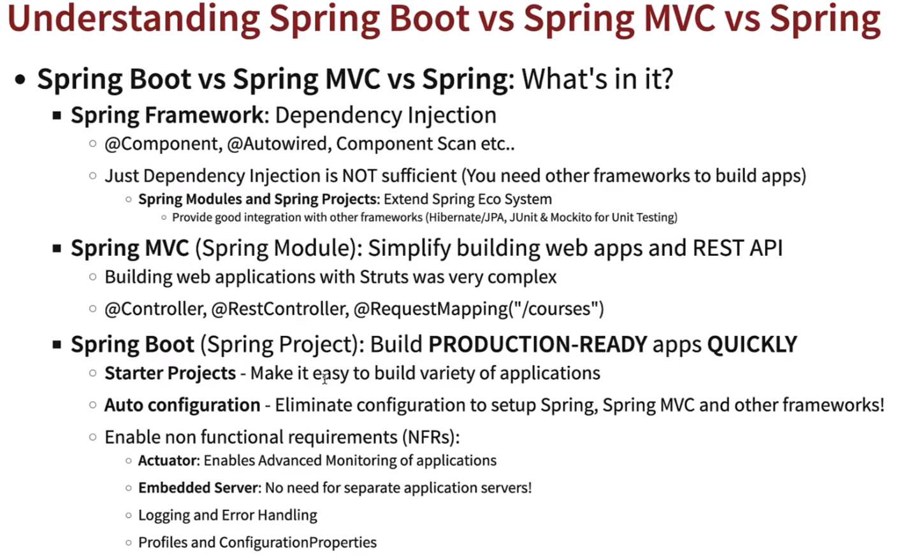
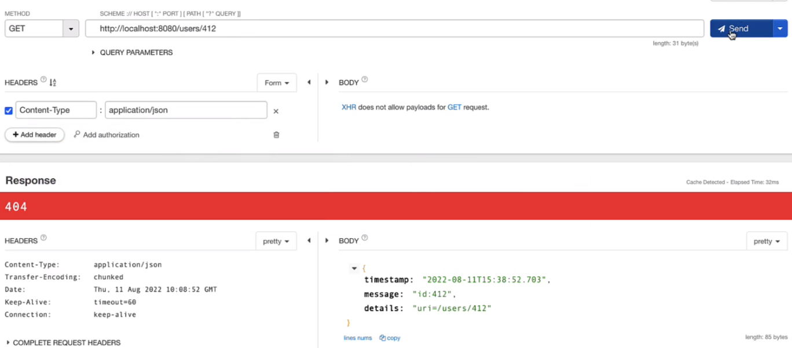
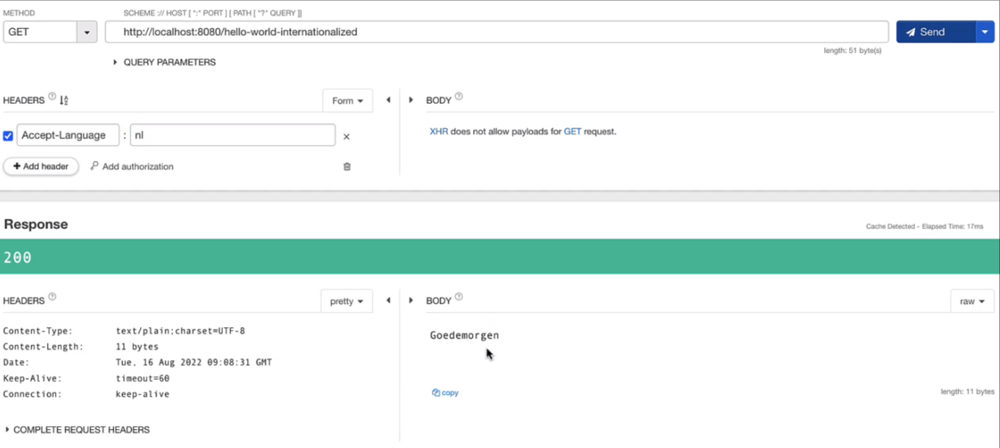
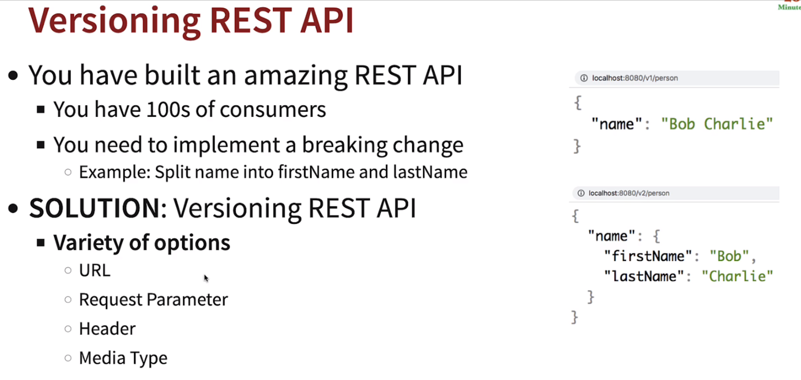
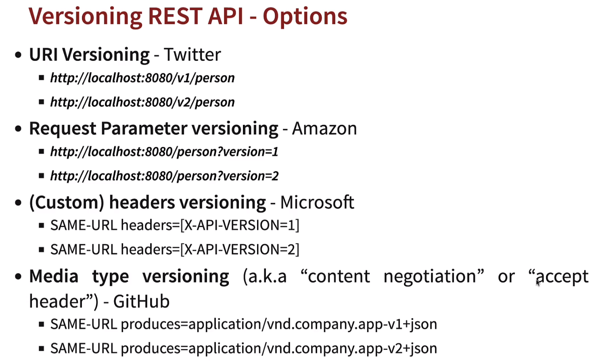
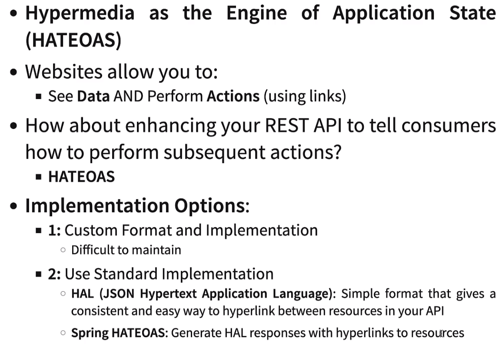
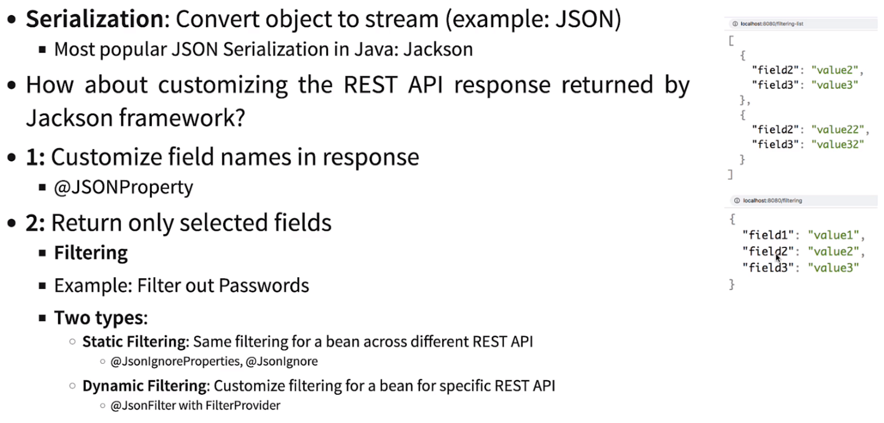

# Matteo Moi

### Notes from my RESTful architecture studies in Spring environment

## TOC

* [Create an instance](#create-an-instance)
* [Delete an Instance](#delete-an-instance)
* [Manage Exception](#manage-exception)
  * [creating a response status](#creating-a-response-status)
  * [create a handler exception](#create-a-handler-exception)
  * [error’s pojo](#errors-pojo)
  * [postman’s response](#postmans-response)
* [Validation](#validation)
* * [On POJO](#on-pojo-validation)
* * [On REST controller](#on-rest-controller-validation)
* [Documentation](#documentation)
* [Content Negotiation](#content-negotiation)
* [Internationalization (i18n)](#internationalization-i18n)
  * [On REST controller](#on-rest-controller-i18n-)
  * [postman’s response](#postmans-response-i18n)
* [Versioning](#versioning)
    * [On REST controller](#on-rest-controller-versioning)
* [HATEOAS](#hateoas)
  * [On POM](#on-pom-hateoas)
  * [On REST controller](#on-rest-controller-hateoas)
* [Customizing Response](#customizing-response)
  * [On POJO](#on-pojo-static-cr)
  * [On POJO](#on-pojo-dynamic-cr)
  * [On REST controller](#on-rest-controller-cr)
* [HAL Explorer](#hal-explorer)
  * [On POM](#on-pom-hal)

# Introduction


### - List of Common Properties : www.luv2code.com/spring-boot-props

### - Full list of actuator endpoints : www.luv2code.com/actuator-endpoints

---

# Spring REST
Add maven Dependency //Spring Boot Starter Web
```xml
<!--   Add Spring Boot Starter Web-->
   <dependency>
   <groupId>org.springframework.boot</groupId>
   <artifactId>spring-boot-starter-web</artifactId>
   </dependency>
```

## Create an instance
```java
@PostMapping
public ResponseEntity<User> createUser(@RequestBody User user) {
        User savedUser = userDao.save(user);
        URI location = ServletUriComponentsBuilder.fromCurrentRequest()
            .path("/{id}")
            .buildAndExpand(savedUser.getId()
            .toUri();
        return ResponseEntity.created(location).build();
}
```

---
## Delete an Instance
```java
@DeleteMapping("/users/{id}")
public void deleteUser(@PathVariable int id) {
        userDao.deleteById(id);
}
```
---
## Manage Exception
### creating a response status
```java
@ResponseStatus(code = HttpStatus.NOT_FOUND)
public class UserNotFoundException extends RuntimeException {
   public UserNotFoundException(String message) {
      super(message);
   }
}
```
### create a handler exception
```java
@ControllerAdvice
public class CustomizedResponseEntityExceptionHandler extends ResponseEntityExceptionHandler{
   
    @ExceptionHandler(Exception.class)
   public final ResponseEntity<ErrorDetails> handleAllExceptions(Exception ex, WebRequest request) throws Exception {
      ErrorDetails errorDetails = new ErrorDetails(LocalDateTime.now(),
              ex.getMessage(), request.getDescription(false));
      return new ResponseEntity<ErrorDetails>(errorDetails, HttpStatus.INTERNAL_SERVER_ERROR);
   }
   
   @ExceptionHandler(UserNotFoundException.class)
   public final ResponseEntity<ErrorDetails> handleUserNotFoundException(Exception ex, WebRequest request) throws Exception {
      ErrorDetails errorDetails = new ErrorDetails(LocalDateTime.now(),
              ex.getMessage(), request.getDescription(false));
      return new ResponseEntity<ErrorDetails>(errorDetails, HttpStatus.NOT_FOUND);
   }
   
   @Override
   protected ResponseEntity<Object> handleMethodArgumentNotValid(
           MethodArgumentNotValidException ex, HttpHeaders headers, HttpStatusCode status, WebRequest request) {
      "Total Errors:" + ex.getErrorCount() + " First Error:" + ex.getFieldError().getDefaultMessage(), request.getDescription(false));
      return new ResponseEntity(errorDetails, HttpStatus.BAD_REQUEST);
   }
}
```
### error’s pojo
```java
public class ErrorDetails {

   private LocalDateTime timestamp;
   private String message;
   private String details;
   
   public ErrorDetails(LocalDateTime timestamp, String message, String details) {
      super();
      this.timestamp = timestamp;
      this.message = message;
      this.details = details;
   }
   
   public LocalDateTime getTimestamp() {
      return timestamp;
   }

   public String getMessage() {
      return message;
   }
   
   public String getDetails() {
      return details;
   }
}
```
### postman's response

---
## Validation
### On POJO (Validation)
```java
public class User {
    private Integer id;
    @Size(min = 2, message=”name should have at least 2 characters”)
    private String name;
    @Past
    private LocalDate birthDate;
```
### On REST controller (Validation)
```java
@PostMapping("/users")
public ResponseEntity<User> createUser(@Valid @RequestBody User user) {
```
---
## Documentation
springdoc-openapi java library helps to automate the generation of API documentation for spring boot projects.
```xml
<dependency>
    <groupId>org.springdoc</groupId>
    <artifactId>springdoc-openapi-starter-webmvc-ui</artifactId>
    <version>2.0.0</version>
</dependency>
```
To access :
- /v3/api-docs
- /swagger-ui/index.html
---
## Content Negotiation
Same Resource - Same URI

HOWEVER Different Representations are possible
1)	Example: Different Content Type - XML or JSON or ..
2)	Example: Different Language - English or Dutch or ..

How can a consumer tell the REST API provider what they want?<br>
Content Negotiation :
- Example: Accept header (MIME types application/xml, application/json, ..)
- Example: Accept-Language header (en, nl, fr, ..)

## Internationalization (i18n)
Create a messages.properties file in the same folder of application.properties
```properties
good.morning.message=Good Morning
```
x = it | fr | de …<br>
**Create a messages_x.properties for each language**<br>

### On REST controller (i18n) :
```java
@Autowired
private MessageSource messageSource;
```
```java
@GetMapping(path = "/hello-world-internationalized")
public String helloWorldInternationalized() {
        Locale locale = LocaleContextHolder.getLocale();
        return messageSource.getMessage("good.morning.message", null, "Default Message", locale);
}
```
### Postman's response (i18n)

## Versioning


### On REST controller (Versioning)
```java
@RestController
public class VersioningPersonController {


    @GetMapping("/v1/person")
    public PersonV1 getFirstVersionOfPerson() {
        return new PersonV1("Bob Charlie");
    }


    @GetMapping("/v2/person")
    public PersonV2 getSecondVersionOfPerson() {
        return new PersonV2(new Name("Bob", "Charlie"));
    }


    @GetMapping(path = "/person", params = "version=1")
    public PersonV1 getFirstVersionOfPersonRequestParameter() {
        return new PersonV1("Bob Charlie");
    }


    @GetMapping(path = "/person", params = "version=2")
    public PersonV2 getSecondVersionOfPersonRequestParameter() {
        return new PersonV2(new Name("Bob", "Charlie"));
    }


    @GetMapping(path = "/person/header", headers = "X-API-VERSION=1")
    public PersonV1 getFirstVersionOfPersonRequestHeader() {
        return new PersonV1("Bob Charlie");
    }


    @GetMapping(path = "/person/header", headers = "X-API-VERSION=2")
    public PersonV2 getSecondVersionOfPersonRequestHeader() {
        return new PersonV2(new Name("Bob", "Charlie"));
    }


    @GetMapping(path = "/person/accept", produces = "application/vnd.company.app-v1+json")
    public PersonV1 getFirstVersionOfPersonAcceptHeader() {
        return new PersonV1("Bob Charlie");
    }


    @GetMapping(path = "/person/accept", produces = "application/vnd.company.app-v2+json")
    public PersonV2 getSecondVersionOfPersonAcceptHeader() {
        return new PersonV2(new Name("Bob", "Charlie"));
    }


}
```
## HATEOAS

### On POM (HATEOAS)
```xml
<dependency>
   <groupId>org.springframework.boot</groupId>
   <artifactId>spring-boot-starter-hateoas</artifactId>
   <version>3.0.15</version>
</dependency>
```
### On REST controller (HATEOAS)
```java
@GetMapping("/users/{id}")
public EntityModel<User> retrieveUser(@PathVariable int id) {
   User user = service.findOne(id);
   if(user==null){
        throw new UserNotFoundException("id:"+id);
   }
   EntityModel<User> entityModel = EntityModel.of(user);
   
   WebMvcLinkBuilder link =  linkTo(methodOn(this.getClass()).retrieveAllUsers());
   entityModel.add(link.withRel("all-users"));
   
   return entityModel;
}
```
---
## Customizing Response

### On POJO [static] (CR)
//for static filter
```java
@JsonProperty("user_name")
private String name;

@JsonProperty("birth_date")
private LocalDate birthDate;
```

### On POJO [dynamic] (CR)
//for dynamic filter
```java
@JsonFilter("SomeBeanFilter")
public class SomeBean {
    private String field1;
    private String field2;
}
```
### On REST controller (CR)
create filtering controller //for dynamic filter
```java
@RestController
public class FilteringController {
    
    @GetMapping("/filtering") //field2
    public MappingJacksonValue filtering() {
        
        SomeBean someBean = new SomeBean("value1", "value2", "value3");
        
        MappingJacksonValue mappingJacksonValue = new MappingJacksonValue(someBean);

        SimpleBeanPropertyFilter filter =
                SimpleBeanPropertyFilter.filterOutAllExcept("field1", "field3");

        FilterProvider filters =
                new SimpleFilterProvider().addFilter("SomeBeanFilter", filter);
        
        mappingJacksonValue.setFilters(filters);
        
        return mappingJacksonValue;
    }

    @GetMapping("/filtering-list") //field2, field3
    public MappingJacksonValue filteringList() {
        List<SomeBean> list = Arrays.asList(new SomeBean("value1","value2", "value3"),
                new SomeBean("value4","value5", "value6"));
        MappingJacksonValue mappingJacksonValue = new MappingJacksonValue(list);

        SimpleBeanPropertyFilter filter =
                SimpleBeanPropertyFilter.filterOutAllExcept("field2","field3");

        FilterProvider filters =
                new SimpleFilterProvider().addFilter("SomeBeanFilter", filter );
        
        mappingJacksonValue.setFilters(filters );
        
        return mappingJacksonValue;
    }
    
}
```

---

## HAL Explorer
### On POM (HAL)
```xml
<dependency>
    <groupId>org.springframework.data</groupId> <artifactId>spring-data-rest-hal-explorer</artifactId>
</dependency>
```


