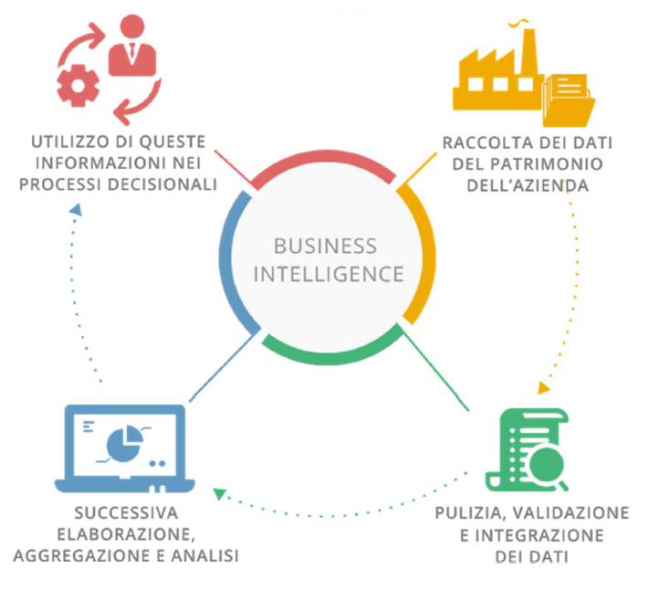

# Business Intelligence
### Definition
Is a set of techniques and tools for the acquisition and transformation of raw data into meaningful and useful information for business analysis purposes. 
The BI provides:
- historical
- current
- predictive

views of business operations, most often using data that has been gathered into a data warehouse or a data mart and occasionally working from operational data. 

