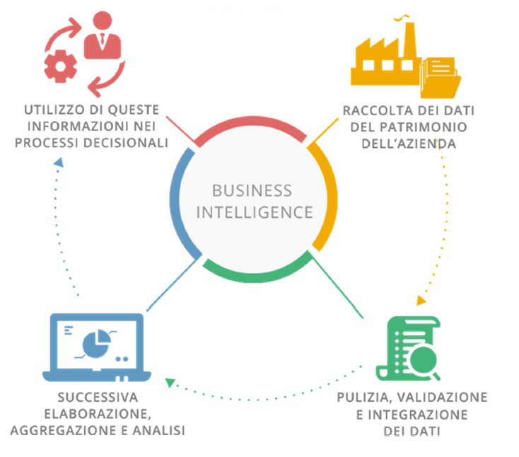

# Business Intelligence
### Definition
Is a set of techniques and tools for the acquisition and transformation of raw data into meaningful and useful information for business analysis purposes. 
The BI provides:
- historical
- current
- predictive

views of business operations, most often using data that has been gathered into a data warehouse or a data mart and occasionally working from operational data. 

# Decision Supporting Systems
### Definition
Is a subset of BI that provides information aimed at assisting organizations in making decision based on data analysis. 
**DDS** are a part of the BI with **data warehouse** and **data mining**. 
DDS categories:
- **Model-driven DSS** - use data and parameters provided by users to assist decision makers in analyzing a situation, but they are not necessarily data-intensive.
- **Data-driven DSS** - use data and specialized analytical models and techniques to assist decision makers in analyzing a situation.
- **Knowledge-driven DSS** - use data and knowledge stored in a knowledge base to assist decision makers in analyzing a situation.
- **Document-driven DSS** - use textual, graphical, audio, and video documents to assist decision makers in analyzing a situation.
- **Communication-driven DSS** - use network, email, groupware, and other communication technologies to facilitate collaborative decision making.

DDS components:
- **Database** - a collection of data organized in a manner that allows access, retrieval, and use of that data.
- **Software system** - a set of programs that manages and controls the data and the interfaces between the data and the users.
- **User interface** - a mechanism through which users see the result.
---
# Data Warehouse
### Definition
- Is a relational database that is designed for query and analysis rather than for transaction processing. 
- It usually contains historical data from different source include those derived from the transactions. 
- The data warehouse is the core of the BI system which is built for data analysis and reporting. 
- Support few clients with complex queries. 

### Components
- **ETL** - Extract, Transform, Load, is the process of copying data from one or more sources into a destination system which represents the data differently from the source(s) or in a different context than the source(s).
- **OLAP** - Online Analytical Processing, a category of software tools that provides analysis of data stored in a database.

### Characteristics
- **Subject Oriented** - data in the database is organized so that all the data elements relating to the same real-world event or object are linked together.
- **Integrated** - data warehouse is usually constructed by integrating multiple heterogeneous sources.
- **Time Variant** - all data in the data warehouse is identified with a particular time period.
- **Nonvolatile** - data in the data warehouse is never over-written or deleted, once committed, the data is static, read-only, but retained for future reporting.

### Purpose
- **Archival** - data warehouses are frequently used to archive older data that are not used in day-to-day operations.
- **Decision Support** - data warehouses contain large amount of historical data that is used for analysis and decision support purposes.
- **Data Consolidation and data quality** - data warehouses can be used to combine and filter data from multiple sources into a single database so that a single query engine can be used to present data.
- **High Performance** - data warehouses are designed to perform well for large number of simultaneous queries.

### Benefits
- **Faster query performance** - data warehouses are designed to perform well for large number of simultaneous queries.
- **Consistency** - data warehouses help in maintaining consistency in naming conventions, encoding structures, measurement of units, and so on.
- **Historical data** - data warehouses enable historical analysis in a way that operational systems cannot.
- **Completeness and Accuracy** - data warehouses can improve the accuracy of data.
- **Trends** - data warehouses can be used to study trends and patterns.
- **Easy querying and data access** - is more efficient and easier to access data from a single data warehouse than to access data from multiple operational systems.

### Data Warehouse vs Database

|                                         | Database                                                                                | Data Warehouse                                                                                                                                         |
|-----------------------------------------|-----------------------------------------------------------------------------------------|--------------------------------------------------------------------------------------------------------------------------------------------------------|
| Utilizzo                                | Elaborazione transazionale online (OLTP)                                                | Elaborazione analitica in linea (OLAP)                                                                                                                 |
| Dati gestiti                            | Dati correnti                                                                           | Anche i dati storici                                                                                                                                   |
| Utenti                                  | Impiegati e clienti                                                                     | Manager e analisti                                                                                                                                     |
| Numero di utenti supportati             | Miglia/milioni di utenti contemporaneamente                                             | Pochi clienti contemporaneamente                                                                                                                       |
| Aggiornamento dei dati                  | Aggiornati di frequente                                                                 | Non volatili. Una volta inseriti i dati cambiano raramente                                                                                             |
| Frequenza di aggiornamento              | Aggiornamenti continui                                                                  | Aggiornamenti periodici                                                                                                                                |
| Normalizzazione delle tabelle           | Tabelle normalizzate                                                                    | Tabelle solo parzialmente normalizzate                                                                                                                 |
| Orientamento                            | Orientato al processo                                                                   | Orientato agli elementi del business                                                                                                                   |
| Dimensione                              | 100 MB-1GB                                                                              | 100 GB-1 TB                                                                                                                                            |
| Join                                    | Bisogna eseguire diversi join                                                           | Non è necessario eseguire join complessi                                                                                                               |
| Modello                                 | Modello Entità / Relazioni                                                              | Modello Dimensionale                                                                                                                                   |
| Ottimizzazione                          | Ottimizzato per operazioni in scrittura                                                 | Ottimizzato per operazioni in lettura                                                                                                                  |
| Prestazioni per operazioni di analisi   | Prestazioni basse                                                                       | Alte prestazioni                                                                                                                                       |
| Tipo di operazioni ottimizzate          | Ottimizzato per semplici transazioni; spesso l’aggiunta o la ricerca una singola riga   | Ottimizzato per accedere a molti dati, eseguendo anche ricerche non previste durante la creazione                                                      |
| Previsione delle operazioni             | Le operazioni possibili sono previste in fase di progettazione                          | L’interattività è una caratteristica irrinunciabile delle sessioni di analisi e fa sì che il carico di lavoro effettivo vari continuamente nel tempo   |

