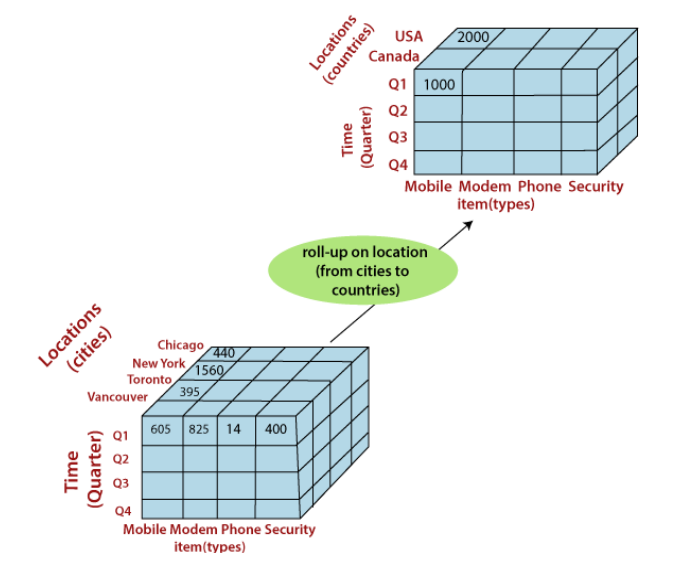

[//]: # (generate TOC for the title with # and ##)

# Business Intelligence
### Definition
Is a set of techniques and tools for the acquisition and transformation of raw data into meaningful and useful information for business analysis purposes. 
The BI provides:
- historical
- current
- predictive

views of business operations, most often using data that has been gathered into a data warehouse or a data mart and occasionally working from operational data. 

# Decision Supporting Systems
### Definition
Is a subset of BI that provides information aimed at assisting organizations in making decision based on data analysis. 
**DDS** are a part of the BI with **data warehouse** and **data mining**. 
DDS categories:
- **Model-driven DSS** - use data and parameters provided by users to assist decision makers in analyzing a situation, but they are not necessarily data-intensive.
- **Data-driven DSS** - use data and specialized analytical models and techniques to assist decision makers in analyzing a situation.
- **Knowledge-driven DSS** - use data and knowledge stored in a knowledge base to assist decision makers in analyzing a situation.
- **Document-driven DSS** - use textual, graphical, audio, and video documents to assist decision makers in analyzing a situation.
- **Communication-driven DSS** - use network, email, groupware, and other communication technologies to facilitate collaborative decision making.

DDS components:
- **Database** - a collection of data organized in a manner that allows access, retrieval, and use of that data.
- **Software system** - a set of programs that manages and controls the data and the interfaces between the data and the users.
- **User interface** - a mechanism through which users see the result.
---
# Data Warehouse
### Definition
- Is a relational database that is designed for query and analysis rather than for transaction processing. 
- It usually contains historical data from different source include those derived from the transactions. 
- The data warehouse is the core of the BI system which is built for data analysis and reporting. 
- Support few clients with complex queries. 

### Type of Components
- **ETL** - Extract, Transform, Load, is the process of copying data from one or more sources into a destination system which represents the data differently from the source(s) or in a different context than the source(s).
- **OLAP** - Online Analytical Processing, a category of software tools that provides analysis of data stored in a database.

### Characteristics
- **Subject Oriented** - data in the database is organized so that all the data elements relating to the same real-world event or object are linked together.
- **Integrated** - data warehouse is usually constructed by integrating multiple heterogeneous sources.
- **Time Variant** - all data in the data warehouse is identified with a particular time period.
- **Nonvolatile** - data in the data warehouse is never over-written or deleted, once committed, the data is static, read-only, but retained for future reporting.

### Purpose
- **Archival** - data warehouses are frequently used to archive older data that are not used in day-to-day operations.
- **Decision Support** - data warehouses contain large amount of historical data that is used for analysis and decision support purposes.
- **Data Consolidation and data quality** - data warehouses can be used to combine and filter data from multiple sources into a single database so that a single query engine can be used to present data.
- **High Performance** - data warehouses are designed to perform well for large number of simultaneous queries.

### Benefits
- **Faster query performance** - data warehouses are designed to perform well for large number of simultaneous queries.
- **Consistency** - data warehouses help in maintaining consistency in naming conventions, encoding structures, measurement of units, and so on.
- **Historical data** - data warehouses enable historical analysis in a way that operational systems cannot.
- **Completeness and Accuracy** - data warehouses can improve the accuracy of data.
- **Trends** - data warehouses can be used to study trends and patterns.
- **Easy querying and data access** - is more efficient and easier to access data from a single data warehouse than to access data from multiple operational systems.

### Data Warehouse vs Database

|                                         | Database                                                                                | Data Warehouse                                                                                                                                         |
|-----------------------------------------|-----------------------------------------------------------------------------------------|--------------------------------------------------------------------------------------------------------------------------------------------------------|
| Utilizzo                                | Elaborazione transazionale online (OLTP)                                                | Elaborazione analitica in linea (OLAP)                                                                                                                 |
| Dati gestiti                            | Dati correnti                                                                           | Anche i dati storici                                                                                                                                   |
| Utenti                                  | Impiegati e clienti                                                                     | Manager e analisti                                                                                                                                     |
| Numero di utenti supportati             | Miglia/milioni di utenti contemporaneamente                                             | Pochi clienti contemporaneamente                                                                                                                       |
| Aggiornamento dei dati                  | Aggiornati di frequente                                                                 | Non volatili. Una volta inseriti i dati cambiano raramente                                                                                             |
| Frequenza di aggiornamento              | Aggiornamenti continui                                                                  | Aggiornamenti periodici                                                                                                                                |
| Normalizzazione delle tabelle           | Tabelle normalizzate                                                                    | Tabelle solo parzialmente normalizzate                                                                                                                 |
| Orientamento                            | Orientato al processo                                                                   | Orientato agli elementi del business                                                                                                                   |
| Dimensione                              | 100 MB-1GB                                                                              | 100 GB-1 TB                                                                                                                                            |
| Join                                    | Bisogna eseguire diversi join                                                           | Non è necessario eseguire join complessi                                                                                                               |
| Modello                                 | Modello Entità / Relazioni                                                              | Modello Dimensionale                                                                                                                                   |
| Ottimizzazione                          | Ottimizzato per operazioni in scrittura                                                 | Ottimizzato per operazioni in lettura                                                                                                                  |
| Prestazioni per operazioni di analisi   | Prestazioni basse                                                                       | Alte prestazioni                                                                                                                                       |
| Tipo di operazioni ottimizzate          | Ottimizzato per semplici transazioni; spesso l’aggiunta o la ricerca una singola riga   | Ottimizzato per accedere a molti dati, eseguendo anche ricerche non previste durante la creazione                                                      |
| Previsione delle operazioni             | Le operazioni possibili sono previste in fase di progettazione                          | L’interattività è una caratteristica irrinunciabile delle sessioni di analisi e fa sì che il carico di lavoro effettivo vari continuamente nel tempo   |

### Components
- **Data Sources** - data sources are the source systems where the data to be loaded into the data warehouse is stored.
- **Staging Area** - staging area is used to store the data extracted from the source systems before it is transformed and loaded into the data warehouse.
- **Warehouse** - data warehouse is the central repository of data which is built for data analysis and reporting.
- **Data Marts** - data marts are the smaller versions of data warehouses which are designed for a particular business line or functional area within an organization.
- **Users** - users are the people who use the data warehouse to analyze the data stored in it and make decisions based on the analysis. 

### Data Sources
- **Production data** - data from production systems such as ERP, CRM, SCM, and so on.
- **External data** - data from external sources such as market data, industry data, and so on.
- **Internal data** - data from internal sources such as sales data, marketing data, and so on.
- **Legacy data** - data from legacy systems such as mainframes, flat files, and so on. 

### Staging Area
- **Extract** - data is extracted from the source systems and copied to the staging area.
- **Transform** - data is transformed to match the data warehouse schema.
- **Load** - data is loaded into the data warehouse. 

### Data Warehouse and Data Marts
- **Read-only** - data warehouse is read-only and does not support any online transaction processing.
- **Single or sectoral Archive** - data warehouse is a single or sectoral archive of the organization's data.
- **Metadata** - data warehouse contains metadata in addition to raw data. 

### Users
- **Analyses** - data warehouse is used by analysts to analyze the data stored in it.
- **Reports** - data warehouse is used by managers to generate reports based on the data stored in it.
- **Data Mining** - data warehouse is used by data mining experts to build data mining models based on the data stored in it. 

---

---

---
# Data Warehouse Architecture

### Architecture Properties
- **Separation** - between analytical processing and transaction processing to avoid interference and slowdowns.
- **Scalability** - to be able to handle the increase in data volume and user requirements updating hardware and software.
- **Extensibility** - to be able to integrate new operations and technologies without having to redesign the entire system.
- **Security** - to protect strategic data from possible unauthorized or malicious access.
- **Manageability** - to facilitate the management of the data warehouse

## Types of architecture

- ### Single-tier architecture
There are no intermediate levels, data is transferred directly from the sources to the data warehouse, which is virtual and not physical. 
This architecture reduces the amount of data stored, but does not separate analytical processing from transactional processing, and makes queries slower and heavier for operating systems.
#### **Charateristics**
- Reduce the amount of data stored
- Virtual Data Warehouse
- No separation between analytical processing and transaction processing
- Queries are slower and heavier for operating systems

- ### Two-tier architecture
There are two intermediate levels, the data warehouse and the data marts. 
The data warehouse is a physical repository that contains all the data integrated from the sources, while the data marts are subsets of data specific to certain users or domains. 
This architecture separates analytical processing from transactional processing, but requires more storage space and can create consistency problems between data marts.

- ### Three-tier architecture
There are three intermediate levels, the staging area, the data warehouse, and the data marts. 
The staging area is a temporary zone where data is cleaned, transformed, and integrated before being loaded into the data warehouse. 
The data warehouse and data marts are as in the 2-level architecture. This architecture improves the quality and reliability of data, but requires even more storage space and complexity. 

---

---

---
# Multi-dimensional Data Model
### Definition
The multidimensional model is part of the **OLAP** (On-Line Analytical Processing) process, 
which allows data to be analyzed from different perspectives and levels of detail. 
Is based on 2 main concepts:
- **Measures**
- **Dimensions**
### Representation
- The axes of the cube represent the **dimensions**
- The cells of the cube represent the **measures** and correspond to a fact

---

---

---

# OLAP operation (On-Line Analytical Processing)
These are operations that allow data to be analyzed from various perspectives, using data cubes organized into dimensions and hierarchies. 
### Characteristics
- The records are organized in a multidimensional structure
- Each dimension include several levels of abstraction (hierarchy)
- Is possible see the data from different perspectives
- Operation on OLAP cubes are interactive

**Structure** 

### Types of operations
**Drill-Up/Roll-Up**
- is the process of navigating from a lower level of data granularity to a higher level of data granularity. (Upscale hierarchy) 

**Drill-Down/Roll-Down**
- is the process of navigating from a higher level of data granularity to a lower level of data granularity. (Downscale hierarchy) 
- Is a navigation from an aggregated record to a decomposed one. 

**Slice**
- Is a subset of a cube, obtained by fixing the value of one or more dimensions. 
- Is a selection of a single value for one or more dimensions. 

**Dice**
- Is the operation of selecting a sub-cube of a cube on one or more dimensions. 

**Pivot**
- Is the operation of rotating the cube to view it from different perspectives. 

---

---

---

# Logic Modeling
### MOLAP (Multidimensional OLAP)
- The data are stored in a multidimensional structure, usually a cube, and are pre-aggregated.
### ROLAP (Relational OLAP)
- The data are stored in a relational database and are not pre-aggregated.
### HOLAP (Hybrid OLAP)
- The data are stored in a multidimensional structure, usually a cube, and are not pre-aggregated.

### Star Schema
A logical model that represents data in a fact table and in multiple dimension tables, connected via foreign keys. 
The fact table contains the measures of interest for the analysis, while the dimension tables contain the descriptive attributes of the analysis dimensions. 
The star schema is simple, intuitive, and fast in queries, but it may require a lot of redundancy and storage space.

### Snowflake Schema
A logical model that normalizes the dimension tables of the star schema, dividing them into multiple related tables. 
The snowflake schema reduces redundancy and storage space, but increases complexity and query time.

---

---

---

# CRISP-DM
### Definition
CRISP-DM stands for Cross Industry Standard Process for Data Mining. 
A process model with six phases that describes the data science life cycle. 
It is the most common methodology for data mining, analytics, and data science projects.

### Phases of CRISP-DM
- Business Understanding -> Understanding the business objectives and requirements.
- Data Understanding -> Collecting and exploring the data.
- Data Preparation -> Preparing the data for modeling.
- Modeling -> Selecting and applying the modeling techniques.
- Evaluation -> Evaluating the model.
- Deployment -> Deploying the model.

Each phase has several tasks and outputs that guide the project from start to finish.

### Agile vs Waterfall
- **Waterfall**

- **Agile**

